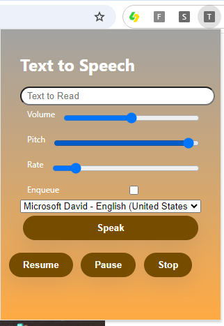
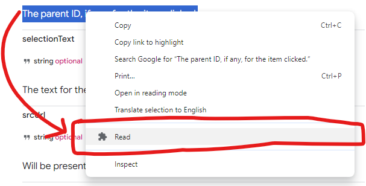

# Text To Speech
A chrome extension that reads out the text a user submits. In addition we will use the chrome.contextMenus API for a user to right-click on selectable text for the system to read out.

